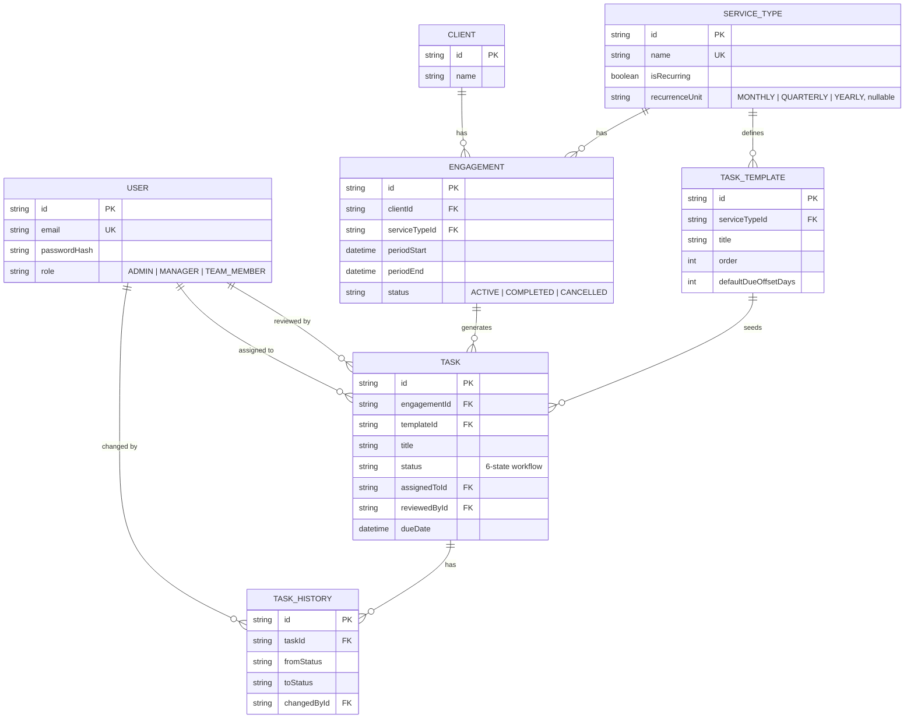

# Technical Design Note — Task & Engagement Management Tool

## Architecture

- **Frontend**: React (planned, not yet implemented at time of writing — the backend was prioritized, per the assignment's own weighting of Backend Engineering (35%) + Database & Domain Design (20%) + Testing (15%) = 70% of the grade, versus Frontend & UX at 10%).
- **Backend**: Node.js + TypeScript + Express 5. Organized as one module per resource (`auth`, `users`, `clients`, `serviceTypes`, `engagements`, `tasks`, `dashboard`), each with a `schema` (Zod), `service` (business logic + Prisma calls), `controller` (HTTP glue), and `routes` (Express `Router` + middleware chain) file.
- **Database**: PostgreSQL, hosted on Neon. Accessed through Prisma ORM 7, which (unlike Prisma 6) requires an explicit SQL driver adapter (`@prisma/adapter-pg`) rather than a bundled query engine binary.
- **Authentication**: Stateless JWT (HS256), issued on login, verified on every protected request — no server-side session store.
- **Deployment**: Not yet deployed. Intended path: API to Render/Railway, frontend to Vercel, both pointed at the same Neon database.

## Database Schema / ERD

Seven models, four enums:



Key constraints:
- `User.email` and `ServiceType.name` are unique.
- **`Engagement` has `@@unique([clientId, serviceTypeId, periodStart])`** — this single constraint is the entire duplicate-prevention mechanism (see below).
- Indexes: `Task(assignedToId, status)` and `Task(dueDate)` back the dashboard's count queries; `Task(engagementId)`, `Engagement(clientId)`, `TaskTemplate(serviceTypeId)`, `TaskHistory(taskId)` back the common lookup paths.
- `Task.templateId` is a nullable FK back to the `TaskTemplate` it was generated from, preserving traceability even after templates change.

## Backend Design

- **API/service structure**: every resource follows `schema → service → controller → routes`. Controllers are thin (unpack request, call service, shape response); all business logic and every Prisma call lives in the service layer, so it's testable independent of HTTP.
- **Validation**: Zod schemas at the route boundary via a generic `validate(schema)` middleware, which parses `req.body` and returns `400` on the first failure. Cross-field rules (e.g. `recurrenceUnit` required only when `isRecurring` is `true`) use Zod's `.superRefine`.
- **Business logic**: lives entirely in `*.service.ts` files — e.g. period normalization, transaction boundaries, and workflow-transition rules never appear in a controller or route file.
- **Error handling**: a single `ApiError` class (`statusCode` + `message`) and one `errorHandler` Express middleware registered last in the chain. Any route handler can `throw new ApiError(...)`; Express 5's native support for async rejection forwarding means no `try/catch`/wrapper boilerplate is needed per route. Prisma's unique-constraint violations (`P2002`) are caught centrally via an `isUniqueConstraintError` helper and translated into clean `409` responses.

## Authentication & Authorization

- **Authentication**: `POST /api/auth/login` verifies the password with `bcrypt.compare` against the stored hash, then issues a JWT (`{ sub: userId, role }`, 8h expiry) signed with `JWT_SECRET`.
- **Server-side enforcement, two layers**:
  1. `requireAuth` middleware — verifies the token's signature/expiry and attaches `{ sub, role }` to `req.user`. Applied to every router via `router.use(requireAuth)`.
  2. `requireRole(...roles)` — a middleware factory checking `req.user.role` against an allow-list. Used for actions where role alone determines permission (e.g. only `ADMIN` can create users or clients).
- **Resource-level authorization** (where role alone isn't enough) lives in the service layer, not middleware — e.g. `updateTaskStatus` checks whether the actor is the task's assignee, a manager/admin, and — for the review transitions specifically — that the actor is *not* the task's own assignee (self-approval block, enforced regardless of role). This can't be expressed as route-level middleware because it depends on the specific task's data.
- **Never-trust-the-client filtering**: `listTasks` forces `where.assignedToId = actor.sub` for `TEAM_MEMBER` callers unconditionally — a query-string override attempt cannot widen what they see.

## Recurring Task Generation

- **Generation**: `POST /api/engagements` creates an `Engagement` and bulk-creates its `Task` rows from the selected `ServiceType`'s `TaskTemplate`s inside one `prisma.$transaction`. `POST /api/engagements/:id/generate-next` computes the following period (`addDays(periodEnd, 1)` always lands on the first day of the next period, for any recurrence unit) and calls the same underlying transactional function.
- **Duplicate prevention**: the client submits any reference date within the desired period; the server normalizes it to a canonical `periodStart`/`periodEnd` per the service type's recurrence unit (e.g. any day in September → `2026-09-01`–`2026-09-30`) before the DB write. Combined with the `@@unique([clientId, serviceTypeId, periodStart])` constraint, this means two different input dates in the same period collide on the same key.
- **What happens if the operation runs twice**: the second attempt's `engagement.create` throws a Postgres unique-violation (Prisma error `P2002`), caught and returned as `409 Conflict`. No partial state results — the failure happens before any tasks are created.
- **What happens if creation fails partway through**: the entire engagement-plus-tasks write is one `$transaction`. If task creation fails after the engagement insert succeeds, Postgres rolls back the whole transaction — there is no code path that leaves an engagement with zero or partial tasks.

## Workflow Rules

State machine (`TRANSITIONS` map in `task.service.ts`):
```
NOT_STARTED → IN_PROGRESS
IN_PROGRESS → READY_FOR_REVIEW | WAITING_FOR_CLIENT
WAITING_FOR_CLIENT → IN_PROGRESS
READY_FOR_REVIEW → COMPLETED | CHANGES_REQUESTED
CHANGES_REQUESTED → IN_PROGRESS
```
Any transition not listed for the task's current status is rejected with `400`.

Two authorization rules apply on top of the state machine:
- **Worker transitions** (everything except the two leaving `READY_FOR_REVIEW`): allowed for the task's assignee or any Manager/Admin.
- **Review transitions** (`READY_FOR_REVIEW → COMPLETED` / `→ CHANGES_REQUESTED`): allowed only for Manager/Admin, and never for the task's own assignee, even if that assignee happens to hold a Manager/Admin role — this generalizes the spec's "a Team Member cannot approve their own work" rule to a role-independent self-review block.

Every successful transition writes a `TaskHistory` row (`fromStatus`, `toStatus`, `changedById`, optional `note`) inside the same transaction as the status update, and a successful review transition also stamps `reviewedById` on the `Task` itself.

## Tests

Six automated tests (Vitest + Supertest), covering all four required scenarios plus one extra:
1. Unauthorized task update is rejected (`403`, actor is neither the assignee nor a manager)
2. Invalid workflow transition is rejected (`400`, e.g. `NOT_STARTED → COMPLETED`)
3. Manager approval works correctly (`200`, status becomes `COMPLETED`, `reviewedById` is stamped)
4. Self-approval is blocked (`403`, assignee tries to approve their own submitted work)
5. Engagement creation generates the correct tasks (`201`)
6. Duplicate recurring engagement is rejected (`409`, using a different day within the same period to prove normalization, not just literal duplicate requests)

Test setup reuses the real service functions (`createUser`, `createClient`, `createServiceType`, `createEngagement`) rather than raw Prisma inserts, so tests exercise the same code path as the API. Tests run against the project's Neon database using uniquely-suffixed records cleaned up in `afterEach`/`afterAll` — a deliberate trade-off (see below) rather than a dedicated test database/branch.

## Production Considerations (at 5 million tasks)

- **Database indexes**: the existing `Task(assignedToId, status)` and `Task(dueDate)` indexes are exactly what the dashboard's five count queries need; at this scale I'd also add a composite index covering `(status, dueDate)` for the overdue/due-today queries specifically, and monitor `pg_stat_statements` to catch any sequential scans that emerge as data grows.
- **Pagination**: current `GET /api/tasks` and `GET /api/engagements` return unbounded lists via `findMany`. At 5M rows this must become cursor-based pagination (Prisma's `cursor`/`take`), not offset-based (`skip` degrades badly at depth) — `dueDate`/`createdAt` plus `id` as tiebreaker make a natural cursor.
- **Background jobs**: recurring generation (`generate-next`) is currently a manual per-engagement API call. At scale this becomes a scheduled job (e.g. a nightly worker querying all `ACTIVE` recurring engagements whose `periodEnd` has passed and calling the same `generateNextEngagement` function) — the function's existing idempotency (via the unique constraint) makes it safe to run on a schedule without extra locking.
- **Dashboard queries**: five `COUNT` queries per request is fine at current scale but would benefit from either a materialized view refreshed periodically, or moving the counts to a read replica, once dashboard traffic and table size both grow.
- **Logging/monitoring**: currently just `console.error` in the central error handler. At production scale this needs structured logging (e.g. pino) shipped to a log aggregator, plus basic APM/tracing on the Prisma query layer to catch slow queries before they become incidents.

## Trade-offs

1. **Vitest over Jest**: the project is ESM-first (`"type": "module"`) using `tsx`, not `ts-node`. Jest's ESM support requires nontrivial extra configuration (`extensionsToTreatAsEsm`, `useESM`, module name mapping for `.js` import extensions) that's a known friction point in exactly this setup; Vitest supports ESM/TS natively with a near-identical API, so it was the pragmatic choice.
2. **Tests run against the real dev database, not an isolated test database**: given the assignment's time budget, provisioning a dedicated Neon branch per test run was judged disproportionate. The mitigation is that every test creates uniquely-suffixed, self-contained records and cleans them up afterward, so test runs don't interfere with seed/demo data or each other. A larger system would use a dedicated ephemeral database per test run.
3. **A generic `Task` history table instead of per-entity audit logging**: `TaskHistory` is purpose-built for task status transitions (typed `fromStatus`/`toStatus` columns) rather than a fully generic audit log across all entities. This trades general-purpose auditability for a simpler, directly queryable transition history on the one entity (`Task`) where the assignment explicitly requires workflow tracking.
